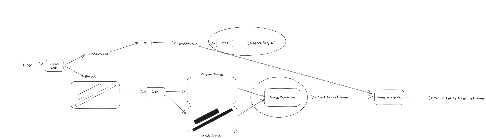
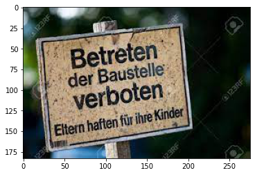
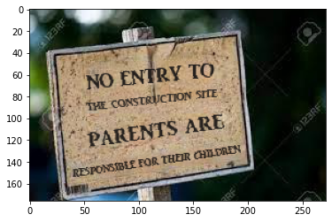

# Google Lens Translator
Created a language translator like google lens for translating image text.
 
Input:
 
  An image including text from source language.
 
Output:
 
1. Translated text in the target language.
2. Translated text in the form of speech.
3. Replacing the translated text in target language in the original Image in the same Foreground and background texture and Font size in the same location.

 
**German sign board:**
 

 
**Sign board in english:**
 

 
**Speech in English:**
 

https://user-images.githubusercontent.com/60774581/170641762-971ff07e-d2f2-4bf3-a2be-100210b02aa0.mov

